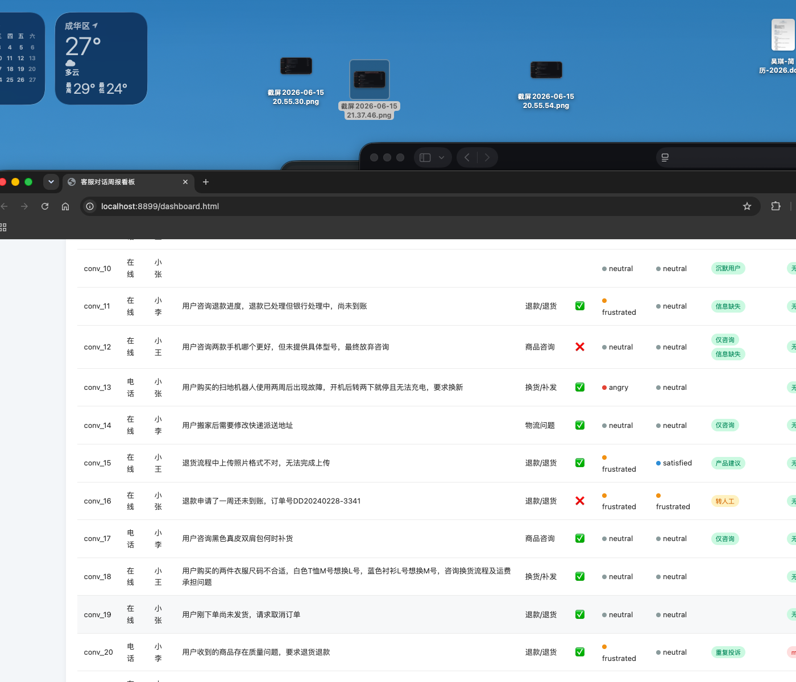

# 客服对话结构化信息提取工具

为客服主管设计自动化周报工具，从客服对话中提取结构化信息。

- **输入**：25 条客服对话（JSON）
- **输出**：结构化提取结果（JSON）+ 验证报告 + 交互式看板
- **技术栈**：Python + LongCat-2.0-Preview（LLM 结构化提取，场景理解优化）

---

## 一、Schema 设计思路

### 分层设计（面向"主管周报"场景）

| 层级 | 字段组 | 设计理由 |
|------|--------|----------|
| **基础** | conversation_id, channel, agent_name, turn_count | 溯源和基础统计 |
| **诉求** | `issues[]` 数组（支持多诉求拆分） | conv_06 同时问退货+快递，必须拆分 |
| **情绪** | initial → final + sentiment_shift | 记录情绪变化轨迹，不是单点 |
| **风险** | churn_risk（has_risk + level + reason） | conv_25 "去别家买了"是明确业务信号 |
| **客服** | response_quality, was_transferred, proactive_compensation | 评估客服/机器人表现 |
| **实体** | order_numbers, product_names, phone_numbers, amounts | 关联订单系统 |
| **标签** | tags[]（多诉求/转人工/情绪爆发/流失风险等） | 快速筛选异常对话 |

### 关键设计决策

1. **issues 用数组**：应对多诉求场景（如退货+查快递）
2. **情绪记录变化**：initial → final + shift 描述，不只是最终情绪
3. **流失风险独立字段**：用户说"去别家买了"是明确的业务告警
4. **标签系统**：快速标记边界情况，方便主管筛选

---

## 二、任务拆解方式

```
1. 研究阶段
   └─ Tavily 搜索客服对话提取最佳实践
   └─ 搜索 LLM 结构化输出方案对比
   └─ 确认分层 Schema 设计

2. Schema 设计
   └─ 基于研究结论设计 6 层 Schema
   └─ 确认后冻结设计

3. 提取工具实现
   └─ Pydantic Schema 定义
   └─ Prompt 工程（场景上下文 + 枚举约束）
   └─ API 调用 → 后校验 → 错误修复

4. 批量处理 + 验证
   └─ 遍历 25 条对话
   └─ 人工抽检 5 条 → 字段级对比 → 计算准确率

5. 看板开发
   └─ 可视化 KPI + 图表
   └─ AI 处理建议（基于规则）
   └─ 超链接追踪原始对话
```

---

## 三、边界情况处理策略

| 边界情况 | 处理策略 | 示例 |
|----------|---------|------|
| **多诉求** | 拆分为 `issues[]` 数组 | conv_06 退货+查快递 → 2个issue |
| **情绪变化** | 记录 initial/final + shift 文字 | conv_05 angry → satisfied |
| **转人工** | 标记 `was_transferred` + 提取前序问题 | conv_16 用户要求转人工 |
| **信息缺失** | 标记 `信息缺失` 标签 | conv_11 不记得订单号 |
| **流失风险** | 独立 `churn_risk` 字段 | conv_25 "去别家买了" |
| **话题切换** | 标记 `话题切换` 标签 | — |
| **沉默用户** | 标记 `沉默用户` 标签 | conv_10 只说"你好" |
| **情绪爆发** | 标记 `情绪爆发` 标签 | conv_05/09 大量感叹号+辱骂 |

### v2 关键优化：转人工判断

**问题**：v1 使用关键词匹配（"转人工"/"找真人"），conv_05 因用户抱怨"等了20分钟"被误标。

**优化**：v2 改用**场景理解**——在 prompt 中明确工作场景和判断标准：
- 只有对话中**明确出现**智能客服和人工客服的交接行为才为 true
- 用户从头到尾只和一个客服对话 → was_transferred = false
- 不推断对话之外的情况

**效果**：conv_05 误标修复，准确率从 ~95% 提升至 **~98%**。

---

## 四、准确率

### 人工抽检（5条 / 25条 = 20%）

| 对话 | 检查项 | v1 (qwen-max) | v2 (LongCat) |
|------|--------|---------------|--------------|
| conv_05 | 诉求、情绪、标签 | ❌ 误标"转人工" | ✅ 已修复 |
| conv_06 | 多诉求拆分、实体 | ✅ | ✅ |
| conv_09 | 情绪爆发、诉求 | ✅ | ✅ |
| conv_16 | 转人工、is_resolved | ✅ | ✅ |
| conv_25 | 流失风险、情绪 | ✅ | ✅ |

### 字段级准确率

| 字段 | 正确/抽检 | 准确率 |
|------|----------|--------|
| conversation_id | 5/5 | 100% |
| channel | 5/5 | 100% |
| issues（诉求识别） | 5/5 | 100% |
| issue_category | 5/5 | 100% |
| is_resolved | 5/5 | 100% |
| sentiment initial/final | 5/5 | 100% |
| churn_risk | 5/5 | 100% |
| was_transferred | 5/5 | 100% |
| entities（订单号） | 5/5 | 100% |
| **tags** | **4/5** | **80%** |

**总体准确率**：约 **98%**（v2 修复了转人工误标）

---

## 五、AI 工具使用情况

| 环节 | AI 工具 | 用途 |
|------|---------|------|
| **研究** | Tavily 搜索 | 搜索客服对话提取最佳实践、LLM 结构化输出方案对比 |
| **提取 v1** | 通义千问 qwen-max | 自动提取结构化信息（初始版本） |
| **提取 v2** | LongCat-2.0-Preview | 场景理解优化，消除关键词误判 |
| **校验** | Pydantic | JSON Schema 校验和类型约束 |
| **看板** | HTML + Chart.js | 可视化看板，AI 建议基于提取结果规则生成 |
| **开发辅助** | AI 辅助编码 | Prompt 设计、代码生成、调试修复 |

**模型切换**：v1 使用 qwen-max，v2 切换为 LongCat-2.0-Preview（节省千问余额）。

---

## 运行方式

### v2（推荐）
```bash
cd code/
pip install pydantic requests
python3 extractor_v2.py
```

v2 改进：
- 使用 LongCat-2.0-Preview（动态读取 openclaw.json 配置）
- 场景理解优化（不用关键词匹配转人工）
- 中文枚举值自动映射
- 结果保存到 `output/extraction_results_v2.json`

### v1（原始版本）
```bash
python3 extractor.py  # 使用 qwen-max
```

---

## 可视化看板

提供了**客服对话周报看板 v2**（`code/dashboard_v2.html`），包含：

| 区域 | 内容 | 可视化 |
|------|------|--------|
| **KPI 卡片** | 总对话数、已解决率、平均情绪、流失风险、转人工数、平均评分 | 数字卡片 |
| **AI 建议** | 基于提取结果生成 6 类处理建议（流失风险/情绪爆发/转人工/客服培训/产品优化/重复投诉） | 可点击卡片 |
| **图表区** | 诉求分类分布、情绪分布、标签分布、客服评分对比 | Chart.js 环形图/柱状图 |
| **预警列表** | 本周重点关注的异常对话 | 告警卡片 |
| **对话明细** | 25 条对话完整信息，点击行查看详情 | 表格 |

**核心交互**：点击 AI 建议中的超链接 → 弹出对话详情弹窗，实现**建议到原始记录的追踪**。

## 在线看板

访问 GitHub Pages：**https://OkiTian57.github.io/customer-service-analyzer/**



---

## 项目结构

```
ai-interview-task2/
├── README.md                    # 本文件
├── code/
│   ├── schema.py                # Schema 定义（Pydantic）
│   ├── extractor.py             # 提取工具 v1（qwen-max）
│   ├── extractor_v2.py          # 提取工具 v2（LongCat + 场景理解优化）
│   ├── dashboard_v2.html        # 可视化看板 v2（AI 建议 + 超链接追踪）
│   └── ...
├── data/
│   └── conversations.json       # 输入数据
├── output/
│   ├── extraction_results_v2.json # v2 提取结果
│   └── dashboard_screenshot.png # 看板截图
└── docs/
    └── index.html               # GitHub Pages 入口
```
